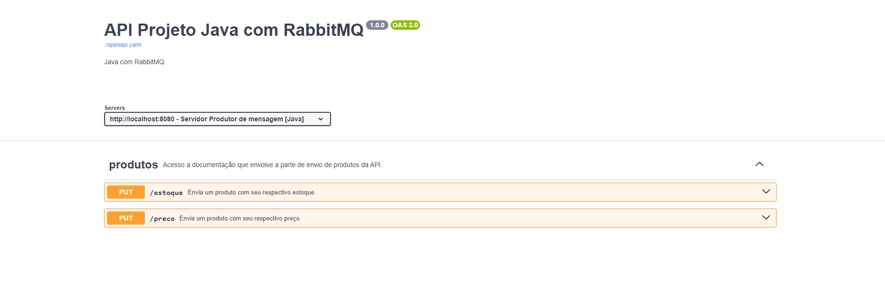
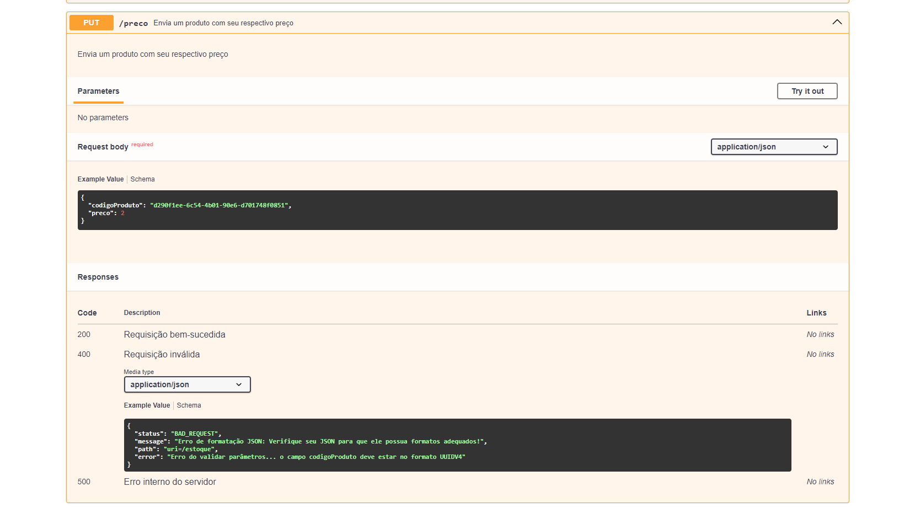
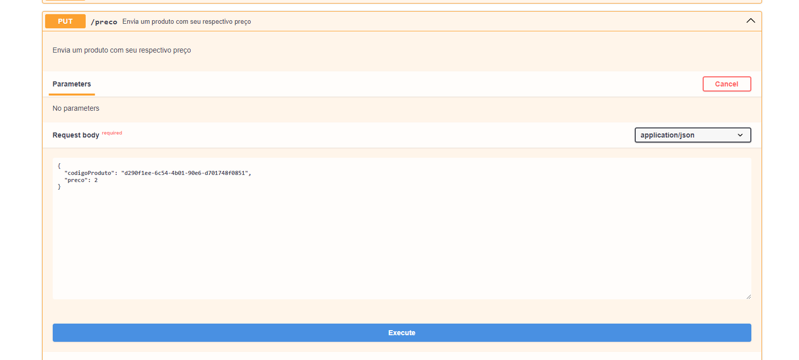
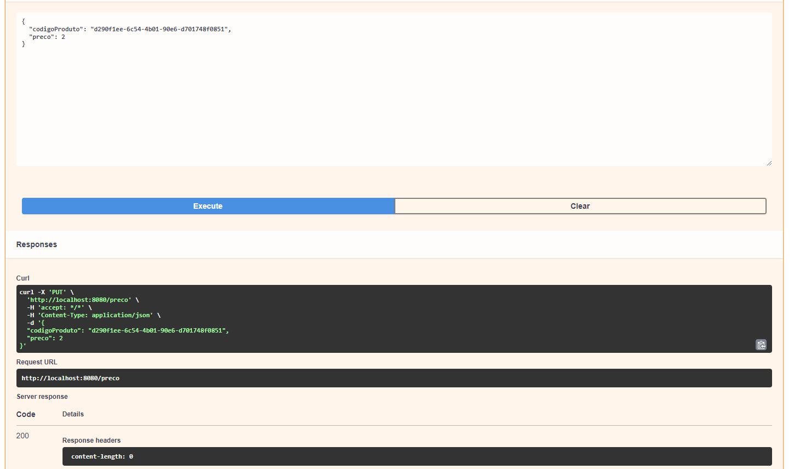
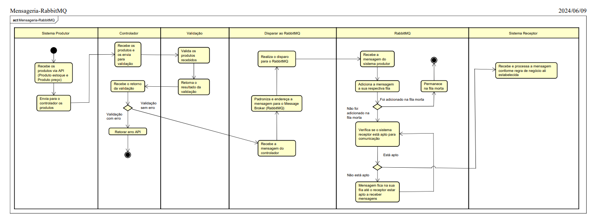

# Swagger: Documentação e Teste de APIs

O Swagger é uma ferramenta de código aberto que permite documentar, desenvolver, testar e visualizar APIs de forma eficiente. Ele fornece uma interface interativa que facilita o entendimento e o uso das APIs por desenvolvedores e usuários finais.

## O que é o Swagger?

O Swagger, agora conhecido como OpenAPI Specification, é um padrão de descrição de APIs que permite documentar as operações, parâmetros, respostas e modelos de dados de uma API de forma clara e estruturada. Ele usa YAML ou JSON para definir a estrutura da API, incluindo endpoints, métodos HTTP, parâmetros, respostas e exemplos de uso.

## Como Utilizar o Swagger para Testar Requisições

O Swagger fornece uma interface interativa chamada Swagger UI que permite testar requisições diretamente na documentação da API. Aqui estão os passos básicos para utilizar o Swagger UI para testar requisições:

1. **Acessar a Documentação da API via Swagger UI:**

   Abra o diretório raiz do projeto, vá até a pasta `/documentacao`, dê um `npm install` e aguarde.

   Após instalar as dependências, execute o arquivo `swagger-ui.html` utilizando a extensão 'Live Server' ou alguma outra que execute um arquivo HTML em forma de servidor local.

2. **Explorar a Documentação da API:**

   Ao abrir o Swagger UI, você verá uma lista de endpoints e operações disponíveis na API, juntamente com detalhes como parâmetros necessários, respostas esperadas e exemplos de uso.

3. **Selecionar o Endpoint e a Operação a Testar:**

   Navegue pela documentação para encontrar o endpoint e a operação que deseja testar. Clique neles para expandir e ver mais detalhes sobre a requisição.

4. **Preencher os Parâmetros da Requisição:**

   Se a operação requer parâmetros, preencha-os conforme necessário. O Swagger UI fornecerá campos de entrada para os parâmetros especificados na documentação.

5. **Enviar a Requisição:**

   Após preencher os parâmetros, clique no botão de envio ("Try it out"). O Swagger UI enviará a requisição para o endpoint especificado.

6. **Analisar a Resposta da Requisição:**

   Após enviar a requisição, o Swagger UI exibirá a resposta retornada pelo servidor. Isso incluirá o código de status HTTP, os headers da resposta e, se aplicável, o corpo da resposta com os dados solicitados.

7. **Testar Diferentes Cenários e Parâmetros:**

   Você pode repetir o processo acima para testar diferentes cenários e parâmetros da API. O Swagger UI facilita a experimentação e a compreensão dos comportamentos da API.

 
 

> **ATENÇÃO:** Para que a documentação funcione corretamente de forma local, é necessário que o Serviço produtor de mensagens esteja disponível e operando corretamente (https://github.com/Blazer25/mensageria-rabbitmq-java-nodejs/tree/master/java-producer-estoque-preco).

 
 

## Exibindo a documentação:

**Visão geral:**
Ao abrir a documentação (swagger-ui.html) com o Live Server ou semelhante, será visualizado a seguinte tela (home da documentação):

**Visão expandida de um endpoint:**

Ao clicar em um dos endpoints exibidos, ele será expandido, mostrando todas as suas informações.
 
Sendo possível visualizar seu verbo HTTP (PUT) no exemplo.
 
Seu parâmetros e suas respostas HTTP.

**Visão da interface de realizar requisição:**

Ao clicar em `try it out` na parte superior do canto direito da visualização do endpoint, será expandido um menu para realizar requisição ao endpoint.
 
Ali será exibido uma caixa de texto que permite sua manipulação, parar conseguir enviar o que desejar para a API, possibilitando que diversos testes sejam realizados.

**Resposta da API após realizar requisição:**

Para realizar a requisição basta clicar no botão `Execute`, após isso, será possível visualizar o resultado da requisição no campo `Responses` abaixo do botão `Execute`

    

## Diagrama de caso de atividade (UML):

O próximo print, exemplifica de maneira simples o funcionamento do sistema, onde um receptor recebe via API informações sobre o produto, valida estas, retorna erro ou as envia para o RabbitMQ, que as encaminha para seus receptores.

